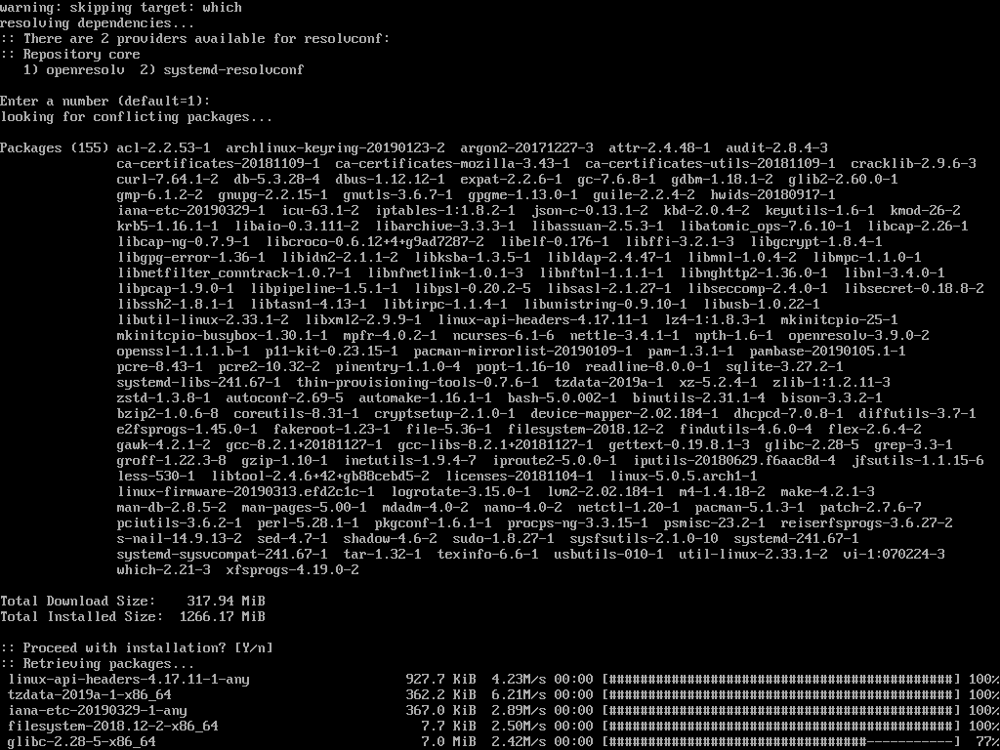
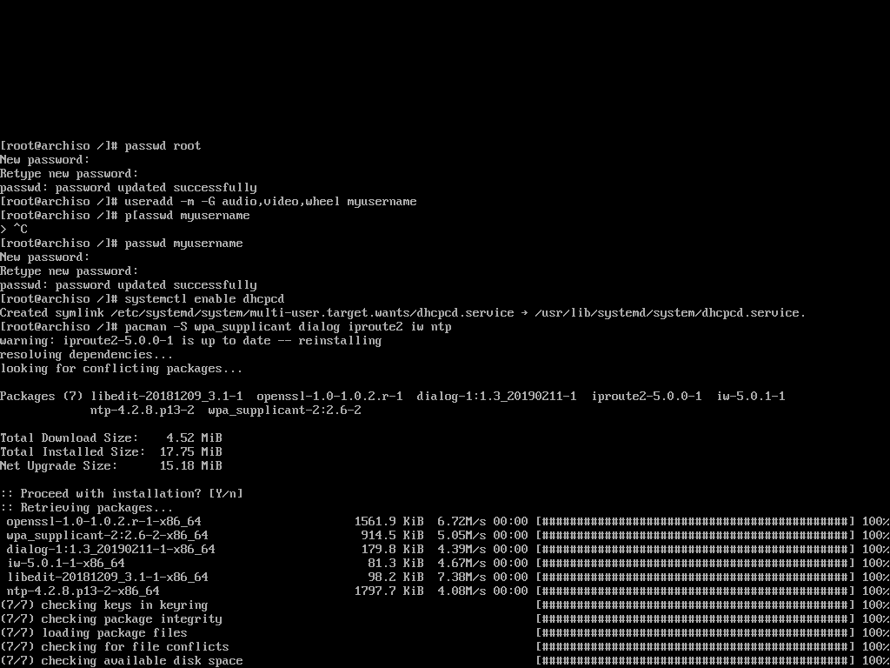

# 小姐姐的arch之旅

## 0.开始之前...

>Arch Linux 是通用 x86-64 GNU/Linux 发行版。Arch采用滚动升级模式，尽全力提供最新的稳定版软件。初始安装的Arch只是一个基本系统，随后用户可以根据自己的喜好安装需要的软件并配置成符合自己理想的系统。
>
>Simplicity · Modernity · Pragmatism · User centrality · Versatility
>
>KISS(Keep It Simple, Stupid)

~~作者在给小姐姐安装Arch时想到总结一下Arch安装的大坑，因此得名（大雾~~

本文将假定读者使用一个装有Windows10操作系统，通过UEFI进行启动的电脑，为读者提供一种arch linux的安装方法。

强烈建议读者在安装前多次阅读Arch Linux的安装指导[ArchWiki - Installation guide](https://wiki.archlinux.org/index.php/Installation_guide)。本文内容也建立在其之上。

读者在阅读时可选择跳过本文中某些明显不适用于自己实际情况的步骤。

如有错误、疏漏，欢迎提出~

### 本文约定

1. 以井号 `#` 开始的命令表示命令需要root权限，以美元符 `$` 开始的命令表示以普通用户运行。注意，arch安装镜像以root用户登录，因此执行的所有命令都以 `#` 开始。

2. 使用 `>>>` 和 `<<<` 表示需要从编辑器中输入的内容的开始和结束，输入时不要输入这些符号。

3. 使用 GNU nano 编辑器编辑文档，你也可以使用你喜欢的其他编辑器，如vim等。

    对于nano编辑器，Ctrl+O或Ctrl+S组合键保存，Ctrl+X退出编辑，其他命令参见编辑器最下方的提示。

4. 当一个命令第一次出现时，可能会给出简单的介绍或解释。

5. 文中可能穿插一些linux基础知识，以引用格式显示。

## 1.你需要准备的...

1. 作为arch栖身之地的电脑
2. 用于写入安装镜像的空U盘
3. 良好的网络连接，有线无线均可
4. 一定的电脑基础
5. 有linux操作经验为佳

## 2.安装之前...

### 了解你的电脑

1. 你的电脑安装了几块硬盘？它/它们的分区是怎样的？

    右键单击开始按钮，在弹出的菜单中选择“磁盘管理”。

    熟悉分区布局，找出EFI系统分区，最好记住EFI系统分区的位置。

    确保磁盘为基本磁盘，即分区上面色带为深蓝色。

    

2. 你的电脑使用哪个热键选择启动项？

    百度直接搜索即可。为从U盘启动做准备。

3. 待定

### 制作USB启动U盘

1. 下载 Arch Linux 启动镜像
    建议从国内镜像源进行下载，这里只列出了三个，选择日期最新的镜像下载即可。

    [清华镜像](https://mirrors.tuna.tsinghua.edu.cn/archlinux/iso/)

    [中科大镜像](https://mirrors.ustc.edu.cn/archlinux/iso/)

    [163镜像](http://mirrors.163.com/archlinux/iso/)

2. 将启动镜像写入空U盘

这里作者建议使用[Rufus](https://rufus.ie/)写入磁盘镜像。

在Device处选择你的U盘，在 Boot Selection 处选择Arch Linux镜像，其他默认，Start进行写入。


### 分配磁盘分区

Arch Linux 约需要 25GiB 或以上磁盘空间。进入“磁盘管理”，右键单击你想要压缩的分区，选择压缩卷，填入合适的空间大小，进行压缩。

### 关闭Secure Boot

本文不处理在Linux下使用Secure Boot的情况。我们直接关闭Secure Boot以顺利启动Arch安装环境以及安装Arch Linux的引导。如果希望在Linux下使用Secure Boot，参见[Secure Boot - ArchWiki](https://wiki.archlinux.org/index.php/Secure_Boot)。

在网络上查找本机型关闭Secure Boot的方法。一般来说，需要在开机时按下热键进入BIOS固件设置界面，在相应选项卡（常为Security）中关闭Secure Boot，保存。

### 重启进入arch live安装环境

重新启动电脑，插上U盘，开机时按下启动选择热键，选择U盘进行启动。

## 3.开始安装

### 连接网络

#### USB共享网络

使手机联网，在设置中开启USB网络共享设置，将手机通过USB连接到电脑上。

```shell
# systemctl start dhcpcd
```

开启DHCP客户端，自动获取IP地址。

#### 有线网络

插入网线。

```shell
# systemctl start dhcpcd
```

开启DHCP客户端，自动获取IP地址。

#### 无线网络

Linux内核集成了绝大部分Intel无线网卡驱动，一般可以正常工作。但是，由于Linux内核没有集成部分其他厂商无线网卡驱动，加之部分特定机型会加载错误的驱动，可能有部分机型无法在archiso中方便的配置使用无线网卡。

> 如果内核中无线网卡没有被对应驱动，在安装完成进入系统后无线网卡很可能也不能正常工作。此时可以在搜索引擎上查找相关网卡在Linux安装驱动的方法。在安装驱动时，优先考虑从AUR中安装（后文介绍）相应驱动软件包，可以避免由于版本问题导致的不兼容安装失败等问题。

因此，更加建议使用USB共享网络或有线网络安装Arch Linux。

首先检测无线网卡是否被正确驱动。

```shell
# dmesg | grep -i wlan
```

如果出现形如

```shell
[   10.903597] iwlwifi 0000:07:00.0 wlp7s0: renamed from wlan0
```

说明驱动正常，否则说明网卡没有被正确驱动，请考虑使用其他方式连接网络。（注：该输出是从配备Intel无线网卡的笔记本中截取，其他品牌、型号输出可能有所不同）

当无线网卡驱动正常时，就可以连接无线网络了。arch安装环境(archiso)提供了交互界面的WIFI管理器 `wifi-menu`。

```shell
# wifi-menu
```

根据其给出的提示连接合适的无线网络。

>命令 `dmesg` 可以查看内核日志，可在其中查找硬件信息。
>
>命令 `grep` 为正则表达式匹配命令，可用于查找某条信息。
>
>另外，命令 `ip` 可以查看和管理系统网络情况
>
>例如 `ip link` 可查看当前各网卡的连接情况，也可用于检测无线网卡是否被正确驱动。

#### 测试网络连通性

```shell
# ping archlinux.org
```

一段时间后出现类似如下输出，说明网络连接正常。按下Ctrl-C终止命令执行。

```shell
PING archlinux.org (138.201.81.199) 56(84) bytes of data.
64 bytes from apollo.archlinux.org (138.201.81.199): icmp_seq=2 ttl=49 time=272 ms
64 bytes from apollo.archlinux.org (138.201.81.199): icmp_seq=3 ttl=49 time=270 ms
```

> 在linux中Ctrl-C组合键终止命令执行。


### 更改arch安装环境(archiso)的镜像源

pacman软件包管理器将从我们设置的镜像源下载所需软件安装包，为了更好的下载速度以及安装体验，建议使用国内源。

```shell
# nano /etc/pacman.d/mirrorlist
```

(在文件的最开始处换行，添加下列内容)

```shell
>>>
    Server = http://mirrors.tuna.tsinghua.edu.cn/archlinux/$repo/os/$arch
    Server = http://mirrors.ustc.edu.cn/archlinux/$repo/os/$arch
    Server = http://mirrors.163.com/archlinux/$repo/os/$arch
<<<
```

这样，下载软件包时，pacman将优先尝试清华镜像、中科大镜像和163镜像。

系统安装时，本文件将自动复制到我们新安装的系统中，因此在进入系统后无需再次配置。


### 建立磁盘分区

***警告：本小节操作有一定风险，如果操作不当可能会损害您的数据，请一定要确认命令正确后，再执行。***

>linux系统秉承一切皆文件的设计思想，她会把绝大部分设备都抽象成一个文件，并显示在 `/dev` 目录中。磁盘和磁盘分区都会被抽象成文件。对于ISE磁盘、SCSI磁盘和SATA磁盘，系统将其命名为形如 `/dev/sdX` 的文件，其中X为从a开始的小写字母。而每个硬盘的分区，将依次从1开始标号，例如：
>
>`/dev/sda` `/dev/sda1` `/dev/sda2`
>
>`/dev/sdb` `/dev/sdb1` `/dev/sdb2` `/dev/sdb3`
>
>这便表示电脑中安装了两块磁盘，分别有2和3个分区。
>
>而对于nvme固态硬盘，由于其采用nvme协议，将被命名为形如 `/dev/nvmeXnY` 的形式，其中X从0开始，Y从1开始。其分区则以 `/dev/nvmeXnYpZ` 形式命名，其中Z从1开始，表示分区编号。

#### 规划系统分区布局

对于基于UEFI的平台，储存EFI引导程序的EFI系统分区(ESP)是必须的。由于本文假设读者在装有Windows的电脑安装Arch Linux双系统，我们将使用Windows的ESP分区。注意，ESP总是使用FAT文件系统(vfat)。ESP仅在系统启动时起作用，因此我们此时不挂载ESP。

一个根分区(root partition, aka /)是必须的。

对Linux只分一个根分区，可以满足大部分安装需求，并且简单不易出错，是本教程的推荐方案。

另外，用户的所有个人文件，如音乐、视频、文档、个人配置等都将位于用户的家目录(`~`)。因此另一种方案将 `/home` 目录，放到单独的分区。重装系统时的数据备份将更为方便。

更多信息，参见[Partition Layout - ArchWiki](https://wiki.archlinux.org/index.php/Partitioning#Partition_scheme)。

#### 找到你要安装linux的磁盘分区

```shell
# lsblk
```

或者

```shell
# fdisk -l
```

根据电脑配备的磁盘类型和磁盘大小找到对应的磁盘文件名。

以 rom, loop 或 airoot 结尾的条目忽略，它们不是真实的物理磁盘。


#### 建立新分区

arch安装环境(archiso)提供的 `parted`, `fdisk`, `cfdisk`等工具可以进行分区。`cfdisk`提供了交互式的分区方式，建议新手使用这个工具。

例如，你将要把系统分区放到 `/dev/sda` 磁盘上。

```shell
# cfdisk /dev/sda
```

按照界面的交互提示进行分区并写入。


### 格式化新分区

***警告：本小节操作有一定风险，如果操作不当可能会损害您的数据，请一定要确认命令正确后，再执行。***

分区被创建后，我们必须将其格式化后才能使用。

这里我们直接使用久经考验的ext4文件系统。如果想要了解或使用其他文件系统，参见[ArchWiki - File systems](https://wiki.archlinux.org/index.php/File_systems)。

例如，根目录所在分区在`/dev/sda1`位置。

```shell
# mkfs.ext4 /dev/sda1
```

家目录在 `/dev/sda2` 位置。

```shell
# mkfs.ext4 /dev/sda2
```

如果读者创建了一个交换分区，位于`/dev/sda3`位置，那么运行以下命令。

```shell
# mkswap /dev/sda3
# swapon /dev/sda3
```


### 将新分区挂载到mnt

将格式化好的分区挂载到 `/mnt` 位置。

如果读者为home、usr或其他位置配置了独立的分区，那么创建相应的挂载点，并把这些分区也挂载到 `/mnt` 的相应位置。

例如，根目录在`/dev/sda1`位置。

```shell
# mount /dev/sda1 /mnt
```

例如，为home配置单独的分区 `/dev/sda2`，注意这里需要手动建立挂载点目录。

```shell
# mkdir /mnt/home
# mount /dev/sdX2 /mnt/home
```

>当储存设备连接时，Windows自动为其中包含的分区加载到系统，并分配盘符。
>
>Linux不会像Windows那样将分区通过分配盘符的方式自动加载到系统中，而是通过一个叫做挂载(mount)的过程将其加载到Linux文件系统中。
>
>挂载(mount)将储存设备加载到文件系统的某个位置，使用户可以通过该目录访问储存设备中的文件，对应的命令为 `mount` 。
>
>不带任何参数的命令 `mount` 列出当前系统挂载的所有设备或分区，可用于检查挂载是否正确。
>
>命令 `findmnt` 提供可读性更佳的树状系统挂载列表，也可用于检查挂载是否正确。

### 将基系统安装到/mnt

```shell
# pacstrap /mnt base base-devel
```



其中，base包含系统必须的核心软件包，必须选择。而base-devel包含用于开发的常用组件和维护工具，如gcc、sudo等，建议安装。

### 创建Fstab

>fstab(5)文件可用于定义磁盘分区，各种其他块设备或远程文件系统应如何装入文件系统。
>
>在系统启动时，`fstab` 中描述的磁盘分区或其他设备将由系统自动挂载(mount)到文件系统。

```shell
# genfstab -U /mnt >> /mnt/etc/fstab
```

### chroot切换到新系统中

```shell
# arch-chroot /mnt
```

### 时间配置

#### 设置时区

```shell
# ln -sf /usr/share/zoneinfo/Asia/Shanghai /etc/localtime
```

这里我们将时区设置为北京时间。

#### 设置与硬件时间的同步

如果你的系统硬件时间为UTC时间，执行下列命令。

```shell
# hwclock --systohc --utc
```

由于Windows操作系统默认把本地时间储存在硬件时钟，所以如果你的系统没有修改过硬件时间设置，我们添加 `--localtime` 参数使arch linux与Windows保持一致，以防止两个系统切换时的时间错乱。

```shell
# hwclock --systohc --localtime
```

> 文末附录中给出使Windows使用UTC时间的注册表文件。

### 设置本地化(locale)

#### locale配置及生成

```shell
# nano /etc/locale.gen
```

反注释其中的 `en_US.UTF-8 UTF-8` 和 `zh_CN.UTF-8 UTF-8`，启用汉语和英语，一般来说，其中的英语 `en_US.UTF-8 UTF-8` 为必选项。

```shell
>>>
    ...
    (other locales)
    ...

    en_US.UTF-8 UTF-8

    ...
    (other locales)
    ...

    zh_CN.UTF-8 UTF-8

    ...
    (other locales)
    ...
<<<
```

生成这些本地化locale

```shell
# locale-gen
```

>在linux交互shell中，`#` 表示root shell。而在shell脚本中，以及各种配置文件(.conf, .cfg 等)中，`#` 表示行注释。在`locale.gen`中，就存在大量被注释的配置行。而反注释就是指删去行首的 `#` 使该行生效。


#### 设置LANG变量，设置语言

```shell
# echo 'LANG=en_US.UTF-8' >> /etc/locale.conf
```

在tty命令行中，设置语言为中文会导致控制台乱码，这里我们设置为英语。

### 配置网络

#### 填写主机名(hostname)并添加到hosts

```shell
# echo 'yourhostname' >> /etc/hostname
```

填写你的主机名即可。

```shell
# nano /etc/hosts
>>>
    127.0.0.1   localhost
    ::1 localhost
    127.0.1.1   yourhostname.localdomain    yourhostname
<<<
```

### 设置root密码

```shell
# passwd root
```

### 创建平时使用的普通用户

```shell
# useradd -m -G wheel,audio,video your_user_name
```

这将自动创建your_user_name的家目录，并将其添加到管理员组(wheel)和audio,video组以便将来使用显卡的硬件加速。

### 设置用户密码

```shell
# passwd your_user_name
```

### 杂项工具安装和系统配置（可选）

```shell
# pacman -S ntp
# systemctl enable ntpd
```

使用ntp从互联网自动获取时间。

```shell
# pacman -S iproute2 iw
```

安装网络管理工具`ip`，无线管理工具`iw`。

```shell
# pacman -S dialog wpa_supplicant
```

安装`wifi-menu`命令所需的软件包。



```shell
# nano /etc/sudoers
```

反注释 `%wheel ALL=(ALL) ALL` ，为`wheel`组添加sudo使用权限。


TODO: 其他配置以及补充配置说明。

### 安装CPU microcode（可选）

For Intel CPU

```shell
# pacman -S intel-ucode
```

For AMD CPU

```shell
# pacman -S amd-ucode
```

### 安装系统启动器(boot loader)

这里我们选用历史悠久，应用广泛的[GRUB](https://wiki.archlinux.org/index.php/GRUB)。

首先安装所需包。

```shell
# pacman -S grub os-prober dosfstools efibootmgr
```

`os-prober` 用于识别计算机上安装的其他操作系统，而 `dosfstools` 和 `efibootmgr` 用于配置UEFI启动。


我们假设读者的电脑上存在基于UEFI的Windows安装，我们将使用Windows的EFI系统分区启动。建立新的EFI系统分区的方法参见文末附录。

#### 找到已有的EFI系统分区。

```shell
# fdisk -l
```

查找其中Type为EFI System的分区，记录其设备名称。一般而言，EFI系统分区经常为某块磁盘的第一个分区。例如，在下图中，EFI系统分区为 `/dev/nvme0n1p1` 。


#### 挂载EFI系统分区。

例如，EFI系统分区位于 `/dev/nvme0n1p1`：

```shell
# mkdir /boot/efi
# mount /dev/nvme0n1p1 /boot/efi
```

#### 安装GRUB

例如，安装grub，启动项名称为GRUB。

```shell
# grub-install --target=x86_64-efi --efi-directory=/boot/efi --bootloader-id=GRUB
```

生成grub配置文件。

```shell
# grub-mkconfig -o /boot/grub/grub.cfg
```


### 退出chroot环境，重新启动电脑，进入新系统

```shell
# exit
# reboot
```

别忘了拔掉U盘哦。

## 4.结束？不，这只是开始...

到这里，arch应该已经成功安装到你的电脑中了。不过，这只是一个包含命令行界面的基本系统，接下来你还需要安装自己需要的各种软件，例如一个桌面环境以提供GUI，一个浏览器，一个代码编辑器...接下来的几小节将讲述一些图形界面安装、以及一些日常系统使用维护内容。

## GUI安装示例

本节提供一个在配备了Nvidia独立显卡的Intel平台笔记本（常见游戏本均为该组合）上安装Xfce4桌面环境的例子。

本文下方还提供了Deepin Desktop Environment(DDE)的安装示例。DDE的动画效果、外观设计等方面体验更佳，而Xfce4简洁而又稳定。

注意，本节所有命令需要root权限，建议使用root用户登录。

### 概述

我们假定的平台----配备了Nvidia独立显卡的Intel平台笔记本有两个显卡，分别为

### 安装Xorg及相关驱动程序

[Xorg](https://wiki.archlinux.org/index.php/Xorg)是X Window System的开源实现，很多桌面环境都使用Xorg作为显示服务器。

关于Xorg驱动安装的更多信息，参见[Xorg#Installation - Arch Wiki](https://wiki.archlinux.org/index.php/Xorg#Installation)。

```shell
# pacman -S xorg xorg-drivers
```

> 下面两小节适用于Intel + Nvidia独立显卡的情况。如果笔记本电脑只配备了Intel显卡或者只配备了AMD显卡，那么跳过下面两小节，Xorg将自动加载合适的驱动程序进行启动，无需手动添加配置文件。

> 由于

### 调整xorg配置

设置Xorg使用Intel核芯显卡，否则Xorg可能无法正确启动。驱动程序 `intel` 由软件包 `xf86-video-intel` 提供，包含在 `xorg-drivers` 组中。

`/etc/X11/xorg.conf.d`是Xorg配置文件目录，Xorg启动时将读取其中的文件并加载其中的配置。为Intel核芯显卡配置创建文件`/etc/X11/xorg.conf.d/20-intel.conf`。

```shell
# nano /etc/X11/xorg.conf.d/20-intel.conf
>>>
    Section "Device"
        Identifier "intel"
        Driver "intel"
        BusID "PCI:0:2:0"
    EndSection
<<<
```


### 禁用nouveau

`nouveau` 是Nvidia显卡的开源驱动，很多时候（例如当前大部分游戏本的新型号独显情况下）它不能正常工作，可能引起系统卡死，内核崩溃等问题，所以我们直接将其禁用。

因此，这个例子中仅使用Intel核芯显卡而不使用Nvidia独立显卡。

如果读者希望启用Nvidia独立显卡，参见[ArchWiki - NVIDIA](https://wiki.archlinux.org/index.php/NVIDIA)以及[ArchWiki - NVIDIA Optimus](https://wiki.archlinux.org/index.php/NVIDIA_Optimus)。

```shell
# echo "blacklist nouveau" >> /etc/modprobe.d/blacklist_nouveau.conf
```


### 安装xfce4桌面环境

[Xfce](https://wiki.archlinux.org/index.php/Xfce) 是一个基于 GTK+2 和 GTK+ 3 的轻量级模块化的 桌面环境。为了提供完整的用户体验，它包含窗口管理器、文件管理器、桌面和面板。

```shell
# pacman -S xfce4 xfce4-goodies
```

### 安装字体

作者个人建议安装的字体。

```shell
# pacman -S noto-fonts noto-fonts-cjk noto-fonts-extra noto-fonts-emoji ttf-dejavu
```

如果想要进一步配置以获得更好的字体体验，参见[ArchWiki - Font Configuration/Chinese (简体中文)](https://wiki.archlinux.org/index.php/Font_Configuration/Chinese_(%E7%AE%80%E4%BD%93%E4%B8%AD%E6%96%87))。

### 安装LightDM

[LightDM](https://wiki.archlinux.org/index.php/LightDM) 是一个轻量级的跨桌面环境的显示管理器。

```shell
# pacman -S lightdm lightdm-gtk-greeter
# nano /etc/lightdm/lightdm.conf
```

`lightdm.conf`是预设好的配置文件，其中有大量被注释掉的配置条目。

#### 设置Xorg图形使用的控制台（可选）

按照历史习惯，Xorg工作在tty7上。

向下翻页，找到 `[LightDM]`，反注释其中的`minimum-vt`配置项。

```shell
minimum-vt=7
```

这将设置lightdm使用的最小虚拟控制台编号为7。


#### 设置启动greeter（必须）

找到 `[Seat:*]`，反注释其中的`greeter-session`配置项，并将其值改为 `lightdm-gtk-greeter`。

```shell
greeter-session=lightdm-gtk-greeter
```

这将设置lightdm登录会话为我们先前安装的`lightdm-gtk-greeter`。


### 测试LightDM

```shell
# lightdm --debug
```

如果出现登录界面，说明安装成功。按下Ctrl + Alt + F1组合键切换到先前的命令行中，按下Ctrl + C终止测试。

>linux系统运行时存在多个（一般为6个命令行界面(tty1-tty6)，一个图形界面）虚拟控制台。在命令行控制台下，我们使用组合键Alt + Fx切换到ttyx中。在图形界面中，这个组合键为Ctrl + Alt + Fx。我们之前的所有操作都是在命令行界面的tty1下进行的。而`lightdm --debug`命令将tty切换到了tty7（对应前面的minimum-vt=7），所以我们需要按下Ctrl + Alt + F1切换回tty1。

### 使LightDM开机自动启动

```shell
# systemctl enable lightdm
```

### 配置网络管理

>NetworkManager是检测网络、自动连接网络的程序。无论是无线还是有线连接，它都可以令您轻松管理。

```shell
# pacman -S networkmanager
```

启用NetworkManager。为防止与dhcpcd冲突，禁用dhcpcd。

```shell
# systemctl enable NetworkManager
# systemctl disable dhcpcd
```

安装nm-applet系统托盘，方便图形化管理。

```shell
# pacman -S network-manager-applet
```

### 重新启动电脑，进入图形界面

```shell
# reboot
```

## 系统使用建议

### 使用普通账户登录

root用户具有的权限过高，可以任意删改系统文件，容易由于误操作破坏系统，在桌面环境中尤其如此。因此，一般来说，我们都以普通用户进行登录，在需要root权限时使用 `sudo` 命令获取权限。

### TODO: other suggestions

## 关于pacman

>[pacman](https://wiki.archlinux.org/index.php/Pacman)是arch linux使用的软件包管理器。*pacman* 通过和主服务器同步软件包列表来进行系统更新。这种服务器/客户端模式可以使用一条命令就下载或安装软件包，同时安装必需的依赖包。

当你想要在arch linux中安装新的软件时，你便需要*pacman*。下面列出*pacman*的常用操作。这部分内容来自archwiki。

>### 安装指定的包
>
>安装或者升级单个软件包，或者一列软件包（包含依赖包），使用如下命令：
>
>```shell
># pacman -S package_name1 package_name2 ...
>```
>
>一些包属于一个可以同时安装的软件包组。例如，运行下面的命令
>
>```shell
># pacman -S gnome
>```
>
>会提醒用户选择 gnome 内需要安装的包。
>
>### 删除软件包
>
>删除单个软件包，保留其全部已经安装的依赖关系
>
>```shell
># pacman -R package_name
>```
>
>删除指定软件包，及其所有没有被其他已安装软件包使用的依赖关系：
>
>```shell
># pacman -Rs package_name
>```
>
>### 升级软件包
>
>一个 pacman 命令就可以升级整个系统。
>
>```shell
># pacman -Syu
>```
>
>警告：建议所有用户都经常性的更新系统。
>

## 软件列表

### 浏览器篇

#### chromium

```shell
# pacman -S chromium
```

#### firefox

```shell
# pacman -S firefox firefox-i18n-zh-cn
```

### 编辑器篇

#### Visual Studio Code

```shell
# pacman -S code
```

### 输入法篇

#### fcitx

> Fcitx 是一个轻量级的输入法框架，可为Linux提供与环境无关的语言输入支持。它支持多种语言，并且可以提供多种实用功能。

```shell
# pacman -S fcitx-im fcitx-configtool
```

加入环境变量，注册输入法模块并支持 xim 程序。

```shell
$ nano ~/.pam_environment
>>>
    GTK_IM_MODULE=fcitx
    QT_IM_MODULE=fcitx
    XMODIFIERS=@im=fcitx
<<<
```

重新登录。此时fcitx应该自动启动，并在系统托盘处显示。

更多信息，参见[Fcitx - Arch Wiki](https://wiki.archlinux.org/index.php/Fcitx_(%E7%AE%80%E4%BD%93%E4%B8%AD%E6%96%87))。

### DDE篇

[深度桌面环境](https://wiki.archlinux.org/index.php/Deepin_Desktop_Environment) (Deepin Desktop Environment, DDE) 是 Linux 发行版 Deepin 的桌面环境。 要在archlinux中安装DDE，安装软件包组`deepin`和`deepin-extra`。

DDE使用xorg。

对于xorg的安装和配置过程，参见上方GUI安装示例中的"安装Xorg","调整xorg配置","禁用nouveau"三个小节内容。

下面安装deepin桌面环境。

```shell
# pacman -S deepin deepin-extra
```

DDE需要NetworkManager服务来管理网络。为防止NetworkManager和dhcpcd服务冲突，禁用dhcpcd。

```shell
# systemctl enable NetworkManager
# systemctl disable dhcpcd
```

与xfce4安装相似，我们还使用lightdm作为桌面环境管理器。

具体过程参见上面"安装LightDM"小节。

需要注意的是，这里我们不再使用`lightdm-gtk-greeter`，而是使用DDE自带的`lightdm-deepin-greeter`以获得更好的桌面体验。

```shell
greeter-session=lightdm-deepin-greeter
```

启用lightdm

```shell
# systemctl enable lightdm
```

#### 关于翻车

之前（2019年1月以及之前）作者曾多次在不同机器上尝试安装DDE，但是总是卡死在用户登录界面，严重时甚至可能卡死整个系统的情况。然而，在作者编写本节时（2019年3月），在作者的拯救者Y7000笔记本上，DDE安装却十分顺利，并且作者多位同学成功安装了DDE。目前作者仍不清楚之前翻车的原因，不过作者编写本节时（2019年3月）DDE看起来是可以正常安装并工作，不需要额外配置。因此读者若希望使用DDE以获得更好的桌面体验，可以放心安装。

### zsh篇

> zsh 是一款功能强大的Shell，它既可以作为一个交互式Shell，也可以作为一个Shell脚本解释器。它在兼容 Bash 的同时还有提供了很多改进，例如：更好的 Tab 自动补全、更好的通配符展开。

更多信息，参见[Zsh - Arch Wiki](https://wiki.archlinux.org/index.php/Zsh)

```shell
# pacman -S zsh
```

#### 安装oh-my-zsh

> Oh My Zsh is a delightful, open source, community-driven framework for managing your Zsh configuration. It comes bundled with thousands of helpful functions, helpers, plugins, themes, and a few things that make you shout...

更多信息，参见其[官方网站](https://ohmyz.sh/)。

安装oh-my-zsh需要安装git。

```shell
# pacman -S git
```

使用oh-my-zsh自动安装脚本。脚本将自动为当前用户安装oh-my-zsh，并且将其设置为默认shell。

```shell
$ sh -c "$(curl -fsSL https://raw.github.com/robbyrussell/oh-my-zsh/master/tools/install.sh)"
```

按照提示输入密码，即完成安装。若要配置zsh，编辑~/.zshrc文件。

### 电源管理篇

> TLP提供适用于Linux的高级电源管理，而无需理解每一个技术细节。

TLP可以一定程度上延长笔记本在Linux下的续航时间。安装TLP软件包以及相关可选功能，并设置TLP开机启动。

更多信息，参见[TLP - Arch Wiki](https://wiki.archlinux.org/index.php/TLP)

```shell
# pacman -S tlp ethtool smartmontools x86_energy_perf_policy
# systemctl enable tlp tlp-sleep
```

## 关于AUR

[Arch 用户软件仓库](https://wiki.archlinux.org/index.php/Arch_User_Repository)（Arch User Repository，AUR）是为用户而建、由用户主导的 Arch 软件仓库。

AUR软件仓库有多个管理程序，由于作者一直使用`yay`，这里给出安装示例。需要注意，安装必须以普通用户进行，一般来说，禁止root权限使用aur。另外需要注意`yaourt`已经停止维护，不建议使用`yaourt`进行管理。

```shell
$ git clone https://aur.archlinux.org/yay.git
$ cd yay
$ makepkg -si
```

另，参见[Arch Build System](https://wiki.archlinux.org/index.php/Arch_Build_System)。

## See Also...

[ArchWiki](https://wiki.archlinux.org)

[ArchWiki - Installation guide](https://wiki.archlinux.org/index.php/Installation_guide)

[ArchWiki - General recommendations](https://wiki.archlinux.org/index.php/General_recommendations)

[ArchWiki - List of applications](https://wiki.archlinux.org/index.php/List_of_applications)

[ArchWiki - Frequently asked questions](https://wiki.archlinux.org/index.php/Frequently_asked_questions)

[鳥哥的 Linux 私房菜](http://linux.vbird.org/)

## 参考资料

[ArchWiki](https://wiki.archlinux.org)

## 附录

### 如果安装ubuntu

图形化开机界面(splash)可能导致nvidia显卡机器卡开机界面，无法正常启动。在grub中关掉它。

### 如果安装Manjaro

注意rufus写入Manjaro镜像时，需要选择dd模式，否则镜像将不能正常使用。

### 如果目标机器为拯救者系列笔记本

默认情况下，linux会加载错误的无线网卡和蓝牙驱动 `ideapad_laptop` ，导致无线网卡和蓝牙无法正常启用，需要将其添加到黑名单。

```shell
# nano /etc/modprobe.d/blacklist_ideapad.conf
>>>
    blacklist ideapad_laptop
<<<
```

### Windows 改为 UTC 时间

新建一个 文本文档，并重命名为：ChangeToUTC.reg，右键ChangeToUTC.reg，选择编辑，填写以下内容。


    Windows Registry Editor Version 5.00
    [HKEY_LOCAL_MACHINE\SYSTEM\CurrentControlSet\Control\TimeZoneInformation]

    "RealTimeIsUniversal"=dword:00000001

双击ChangeToUTC.reg，合并到注册表。

### 如何建立新的EFI分区

如果读者需要建立新的EFI系统分区，参见本节。

使用cfdisk建立分区，例如，在 `/dev/sda` 磁盘上建立EFI系统分区。

```shell
# cfdisk /dev/sda
```

在Free Space上选择 `New` 建立一个新分区。常见的EFI系统分区大小约为256MB。然后在新分区上选择 `Type` ，类型选择 `EFI System` 。然后选择 `Write` 写入更改。记录新建的分区设备名称，之后，选择 `Quit` 退出。

例如，图中建立的分区为 `/dev/sda1` 。


格式化EFI系统分区。EFI系统分区需为FAT文件系统，格式化FAT文件系统的命令由上文GRUB小节中描述的 `dosfstools` 软件包提供。

```shell
# mkfs.vfat /dev/sda1
```
