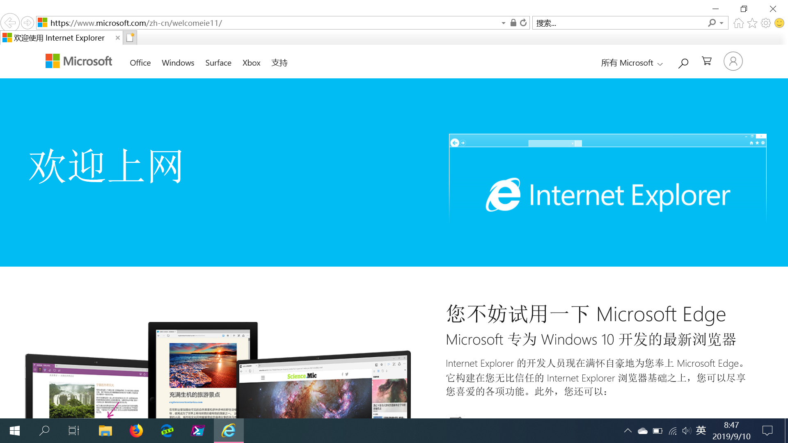

# Windows浏览器

## FireFox

Firefox是由Mozilla推出的开源浏览器，已经有14年的历史，目前市场占有率仅次于Chrome。全新重写的量子火狐(Firefox Quantum)也改善了火狐启动慢、资源占用多的问题，很大地提升了网站渲染和加载的速度。

Firefox以拓展性强著称，大量的可定制选项和丰富的浏览器拓展是火狐最吸引用户的特性。我们可以方便地访问火狐的拓展商店，搜索和安装新的拓展。对浏览器拓展性感兴趣的用户可以考虑火狐浏览器。

同时，火狐自带的同步服务能使我们在多个设备上轻松同步浏览器状态，以获得一致的浏览体验和良好的多设备协同体验。

此外，火狐是目前唯一的一款由开源社区主导而非商业公司主导的自由开源的浏览器。火狐背后的Mozilla组织在现代Web标准中也有着杰出的贡献。

## Chrome

Chrome是由谷歌基于开源项目Chromium制作的浏览器。其中Chromium是谷歌为开发Google Chrome浏览器而组织的一个开源项目，主要由谷歌的开发者进行维护。Chromium项目对现代Web技术有很大的贡献。

Chrome以简洁快速著称，其使用的JavaScript引擎是各大浏览器中优化最好的，加之不输火狐的浏览器拓展支持，使其获得了大多数用户的青睐。

不过由于众所周知的原因，用于下载拓展的Google Chrome网上应用店无法在国内直接访问，Chrome的拓展下载不是很方便，同时Chrome自带的同步服务也没有办法直接访问使用。

Chrome系浏览器是目前市场占有率最高的浏览器。

## Edge

Edge是微软为Windows 10开发的新浏览器。在Windows 10中Edge成为默认浏览器，代替了传统而老旧的Internet Explorer(IE浏览器)。

Edge浏览器的运行速度和对新网页标准的支持相对IE有了很大的改善，已经成为一个优秀的现代浏览器。不过由于Edge仍不够开放，浏览器拓展性不太好。

## Edge Chromium版

微软在今年（2019）发布消息称将基于Chromium项目开发下一代的Edge浏览器，而不是在原有的Edge浏览器的基础上继续开发。目前Edge Chromium已经发布了开发板和预览版，已在官方网站提供下载，不过仍没有发布稳定版本。在未来，Edge Chromium可能会直接预装在Windows 10中。

基于Chromium项目，新版Edge Chromium提供了与Google Chrome一样快速的浏览体验，再加上微软加入的优化，以及与微软账户、应用商店体系的全面接入，虽然仍没有发布正式版，但仍是一款非常值得推荐的浏览器。

如果不希望通过特殊方式访问谷歌服务，但希望使用Chromium内核浏览器，Edge Chromium是一个非常好的代替方案。

## Internet Explorer

Internet Explorer是旧的Windows默认浏览器。目前IE浏览器的开发已经停止，不能再获得功能更新，只能获得安全更新。在日新月异的网页技术发展中，IE已经落后于时代，部分网站已经不再支持IE，而且IE的性能也低于其他新的浏览器。

不过，由于国内还存在部分旧网站为IE only，不支持其他浏览器，所以还是有时还是需要IE浏览器的。要打开IE，最方便的方式是在开始菜单搜索框里输入IE，就可以找到IE浏览器。

## 其他国产浏览器

均基于Chromium构建，大部分基本上属于套壳产品，创新不多，还有很多厂商加入了自己的广告等。

**一般不推荐使用。**