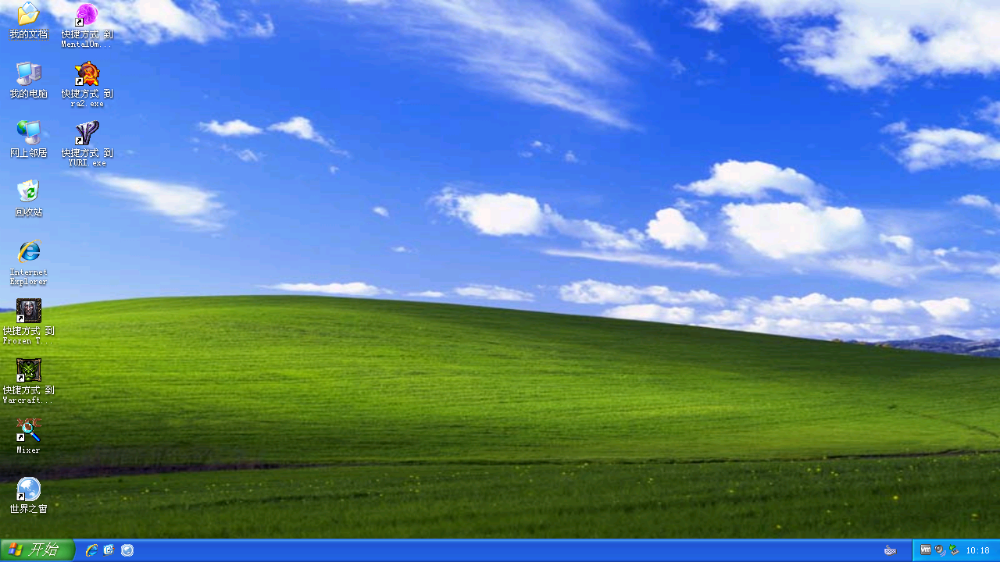
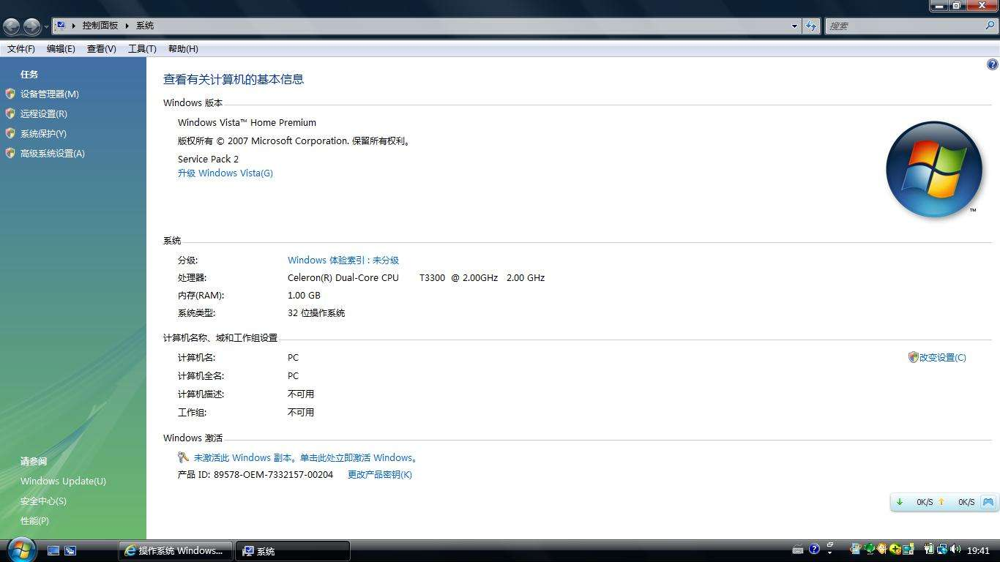
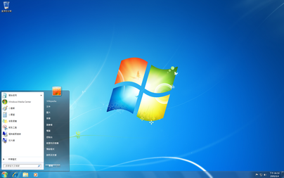
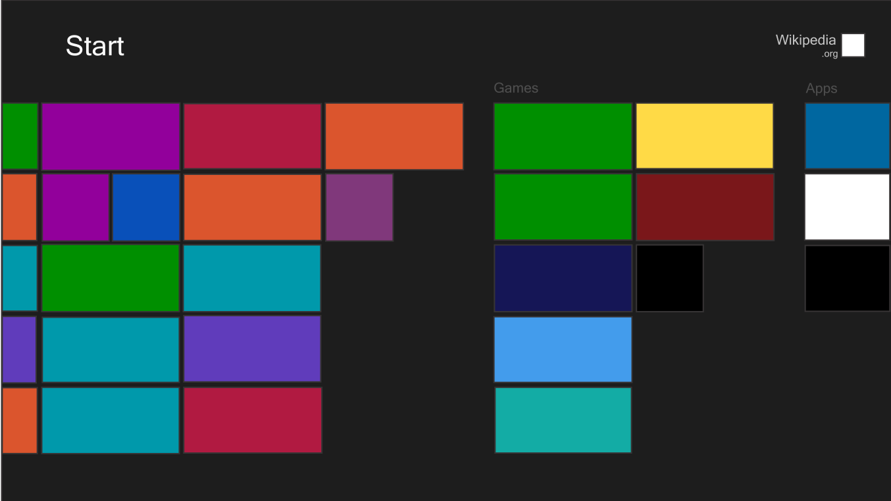

# Windows简史

## Windows XP

发布于2001年的Windows XP(Windows eXPerience，体验)随着电脑进入千家万户被无数人所熟悉，经典的蓝天白云可能也成了许多同学的童年回忆。Windows XP是第一个面向个人用户的使用NT内核的Windows版本，摆脱了古老的MS-DOS的阴影，第一次将之前适用于工作站和服务器的系统安全特性和系统可靠性带给了个人用户，这使得她相比于前代的Windows 98/Me稳定性大大提升，而相比于同为NT内核但面向专业人员的Windows 2000，她的易用性大大提升，普通用户也能很快驾驭。**再加之全新设计的Windows XP主题和视觉效果，给人耳目一新之感，引领了一代软件UI设计的潮流。**

**Windows XP的最后一个Service Pack(SP 3)发布于2008年，主要支持（功能更新）于2009年4月8日到期，而扩展支持（安全更新）于2014年4月8日到期，一代经典就此落幕。**在2007年1月，Windows XP的市场占有率达历史最高水平，超过76%，在2012年才最终被Windows 7超过，统治操作系统市场长达11年之久，足见其影响力。

Windows XP还有一个对应的服务器版本Windows Server 2003，值得注意的是两者的内核版本并不相同，发布于2003年的Windows Server 2003实际上是Windows XP的演进产品。

## Windows Vista

发布于2006年的**Windows Vista（远景）是Windows XP的继任者。**可能同学对Windows Vista没有深刻印象，的确，她并没能完成接替Windows XP这个任务，**但是从技术上，她为接下来的Windows奠定了坚实的基础。**

Windows Vista使用了全新重写过的Windows NT 6.0内核，加强了对驱动程序的管理，大大提高了系统的安全性、稳定性和健壮性。同时她引入了更严格的安全策略，提倡权限控制，避免在非必要的时候使用管理员权限。著名的UAC权限管理便是在Windows Vista引入的，通过限制管理员用户的权限，一定程度上防止了用户错误操作损坏系统，提供了更高的安全性。不过Windows Vista中的UAC设计并不十分人性化，也惹来了很多批评之声，同时全新的UAC也带来了很多的兼容性问题，当时的很多旧有软件无法在Vista正常运行。此外，Windows Vista引入了更好的3D支持和改进的Aero窗口管理，将各个窗口的渲染分离，加上华丽的专为Aero设计的毛玻璃特效，给人全新的体验。

**然而饱受诟病的一点是Windows Vista的运行要求的内存和显卡资源较多，当时很多的电脑都无法流畅运行她。总之，Windows Vista的并不人性化的权限管理和较高的运行需求，以及各种兼容问题使得用户并不买账。**不过从后来者角度观之，Windows Vista可谓是一个具有超前设计的操作系统。

## Windows 7

**发布于2009年的Windows 7是继Windows XP之后又一个取得空前成功的操作系统。**不过事实上，Windows 7是Windows Vista的“改良版”（微软前CEO鲍尔默）。很多让人熟知的Windows 7特性实际上都是在Windows Vista便引入的。Windows的内核版本为NT 6.1，Windows 7与Windows Vista的关系恰似Windows XP与Windows 2000的关系。

在Windows 7中，UAC更改为可以由用户自由调整级别，其默认级别将不再为Windows本身的大部分配置更改弹出提权窗口，提供了更好的用户友好性而又保留了其安全特性。Windows 7对Aero也有一定的改进，性能更好，同时随着硬件的进步，大部分电脑都能流畅的运行这些特效。

**2012年，Windows 7占有率超过Windows XP，不过仍未能达到Windows XP曾达到的统治地位。**

**Windows 7的最新SP版本为SP1，发布于2011年。Windows 7主流支持已于2015年1月13日到期，扩展支持将于2020年1月14日到期。**一百多天后，Windows 7的王朝也将落幕。

## Windows 8

Windows 8是于2012年推出的下一代操作系统。**Windows 8强调适用于触屏的平板电脑设计，传统的开始菜单被替换成开始屏幕。**传统的Aero毛玻璃风格被取消，转而使用新的界面风格Metro（现代UI，Modern UI），**具有直角矩形风格和大字体磁贴。**在后来的Windows操作系统中，这种设计风格被继承了下来。同时，**Windows 8还引入了Microsoft商店，这代表着微软希望统一管理应用程序分发和安装的尝试。**

值得注意的是，在Windows 8及之后的操作系统虽然没有了毛玻璃特效，但是其背后的Aero渲染方式并没有取消，并且不能关闭，作为对比，Windows 7中Aero可以彻底关闭，使用旧的渲染逻辑。

然而，由于界面的改变太大，尤其是删除了标志性的开始菜单，**Windows 8难以被用户适应，并受到批评，并没有被用户接受。**

## Windows 8.1

**Windows 8.1是Windows 8的升级版本**，发布于2013年，用户可从Windows 8免费升级到Windows 8.1。

在Windows 8.1中，开始菜单再次回归，同时也优化了系统UI，系统更加美观。

相比Windows 8，Windows 8.1的市场表现较好，但仍远不及Windows 7。

## Windows 10

Windows 10是最新一代Windows操作系统。她的内核版本为10.0，而之前Windows 8.1内核版本为6.3，足可见微软推出Windows 10做出改变的决心。不夸张地说，**Windows 10是未来Windows的方向。**

**目前市面上的硬件很多已经不再提供对旧版本Windows提供支持，这就意味着只有Windows10才能获得最好的用户体验，如各种硬件加速等。**

Windows 10引入微软所描述的“通用Windows平台”（UWP），并把Modern UI风格的应用程序扩充，她们可以运行在多个平台上，并在Microsoft Store中统一安装、管理。

Windows 10还引入了全新编写的浏览器Edge，并将之前的IE浏览器隐藏到了很深的位置。不过，微软已经开始开发基于开源项目Chromium的Edge浏览器，而不是继续使用全自主开发的浏览器内核。目前Chromium版Edge已经放出开发版和预览版。

**微软将Windows 10变成一项服务，持续接收更新。**到目前为止，Windows 10已经以接近一年两个版本更新的速度演进出了8个版本。不过Windows 10中的强制更新策略，即用户无法选择是否安装更新，而只能推迟和暂时停止接受，饱受用户的批评。不过，微软近期正在逐渐改变更新策略，从而使得用户能够获得更好的更新体验。

在每次大版本更新中，Windows 10都会引入大量值得用户期望的新特性、性能改善和UI改进。

**根据微软官方统计，Windows 10的占有率已经超越Windows 7，在所有Windows中位列第一。目前市面上预装Windows的笔记本预装版本均为Windows 10。**

| **版本号** | 发布时间 | 官方代号 | 市场代号 | 内部版本号 |
| ------ | ------------ | ---- | ------ | ------ |
| 1507   | 2015/07/29 | Threshold1 | --- | 10240 |
| 1511   | 2015/11/10 | Threshold2 | November Update | 10586 |
| 1607   | 2016/08/02 | Redstone1 | Anniversary Update | 14393 |
| 1703   | 2017/04/05 | Redstone2 | Creators Update | 15063 |
| 1709   | 2017/10/17 | Redstone3 | Fall Creators Update | 16299 |
| 1803   | 2018/04/30 | Redstone4 | April 2018 Update | 17134 |
| 1809   | 2018/11/13 | Redstone5 | October 2018 Update | 17763 |
| 1903   | 2019/05/21 | 19H1 | May 2019 Update | 18362 |

